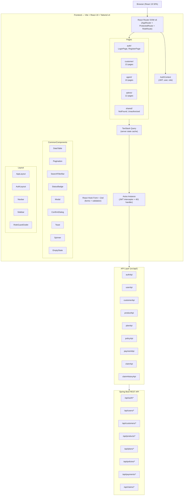
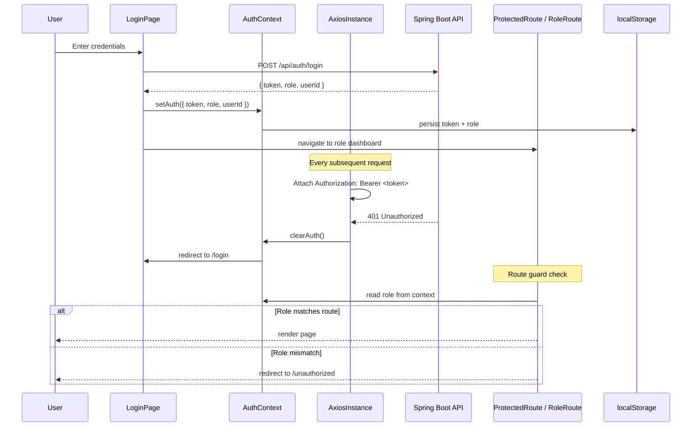
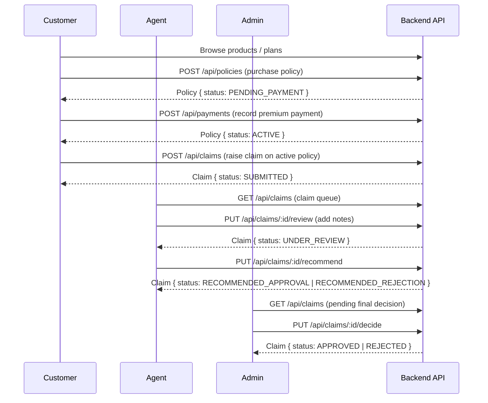
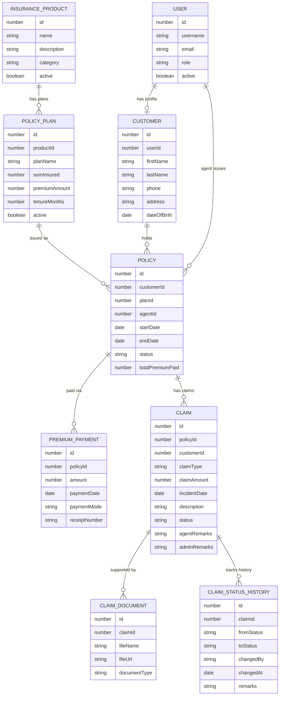
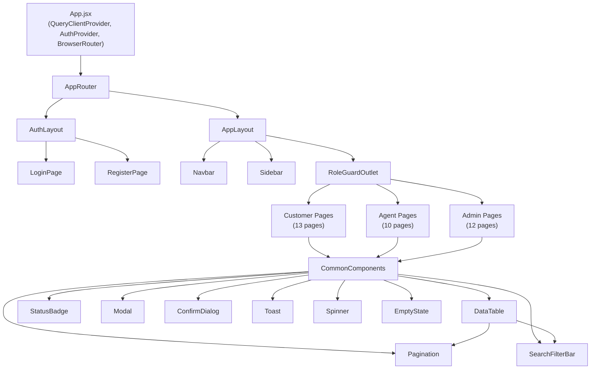
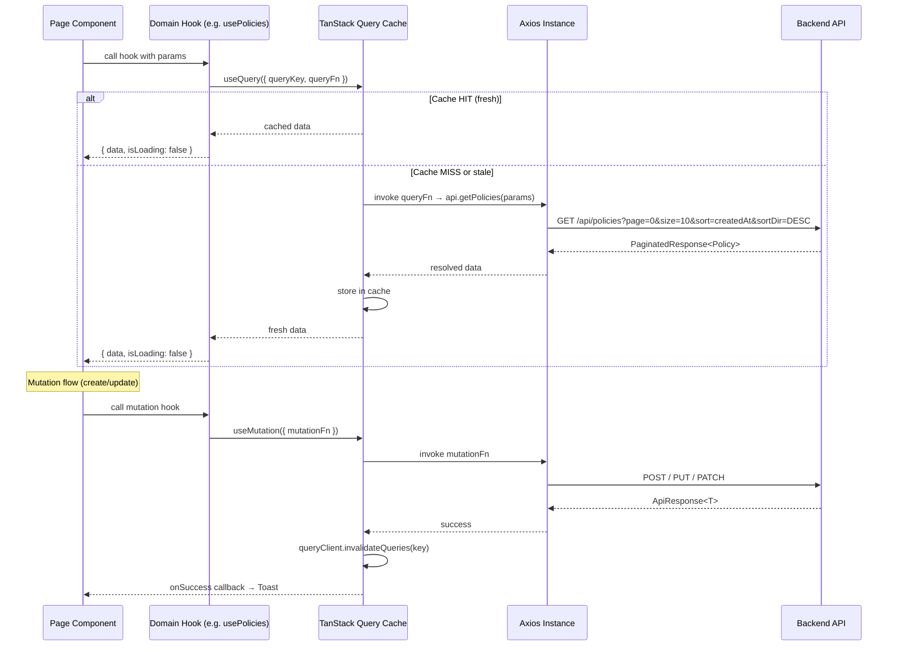
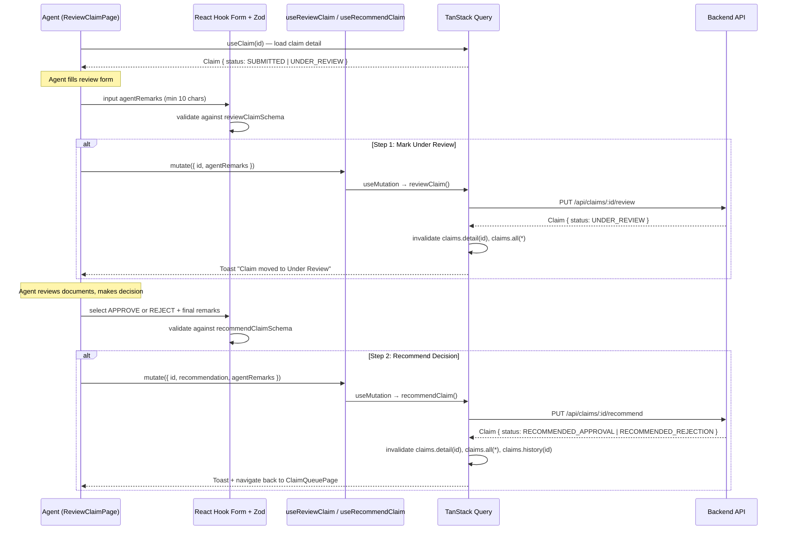

# Design Document: Insurance Policy and Claim Management System — Frontend

## Overview

This document covers the full technical design for the frontend of the Insurance Policy and Claim Management System. The application is a React 19 single-page application built on Vite and styled with Tailwind CSS v4. It consumes a Spring Boot REST API and supports three roles — Admin, Agent, and Customer — each with a distinct feature surface, enforced through JWT-based auth and route-level role guards.

The design is split into two parts: a **High-Level Design** covering architecture, data flow, routing, and entity relationships; and a **Low-Level Design** covering component interfaces, hook signatures, API service contracts, Zod schemas, and the core pagination/filtering algorithm.

---

# Part 1: High-Level Design

## 1.1 System Architecture Overview




## 1.2 Authentication and Authorization Flow




## 1.3 Core Business Flow — Policy Lifecycle




## 1.4 Entity Relationship Diagram (Frontend Data Model)




## 1.5 Application Routing Tree

```
/                           → redirect based on role
/login                      → LoginPage (public)
/register                   → RegisterPage (public, customer signup only)
/unauthorized               → UnauthorizedPage (public)
/*                          → NotFoundPage (public)

/customer/*                 → RoleGuardOutlet [CUSTOMER]
  dashboard                 → CustomerDashboard
  profile                   → CustomerProfile
  products                  → ProductsPage
  products/:id/plans        → PlansPage
  policies/purchase/:planId → PurchasePolicyPage
  policies                  → MyPoliciesPage
  policies/:id              → PolicyDetailPage
  policies/:id/pay          → MakePaymentPage
  payments                  → PaymentHistoryPage
  claims                    → MyClaimsPage
  claims/raise/:policyId    → RaiseClaimPage
  claims/:id                → ClaimDetailPage

/agent/*                    → RoleGuardOutlet [AGENT]
  dashboard                 → AgentDashboard
  customers                 → CustomerListPage
  customers/:id             → CustomerDetailPage
  policies/issue            → IssuePolicyPage
  policies                  → PolicyListPage (all agent policies)
  payments/record           → RecordPaymentPage
  payments                  → PaymentListPage
  claims                    → ClaimQueuePage
  claims/:id/review         → ReviewClaimPage
  claims/history            → ClaimHistoryPage

/admin/*                    → RoleGuardOutlet [ADMIN]
  dashboard                 → AdminDashboard
  users                     → UserListPage
  users/create-agent        → CreateAgentPage
  products                  → ProductListPage
  products/new              → ProductFormPage
  products/:id/edit         → ProductFormPage
  plans                     → PlanListPage
  plans/new                 → PlanFormPage
  plans/:id/edit            → PlanFormPage
  policies                  → AdminPolicyListPage
  claims                    → AdminClaimListPage
  claims/:id/decide         → ClaimDecisionPage
  claims/history            → AdminClaimHistoryPage
  payments                  → AllPaymentsPage
```


## 1.6 Component Architecture




## 1.7 Server State and Data Flow




## 1.8 Role-Based Access Control Matrix

| Resource                    | Customer | Agent | Admin |
|-----------------------------|:--------:|:-----:|:-----:|
| Register / Login            | ✅       | ✅    | ✅    |
| Own Profile (R/W)           | ✅       | —     | —     |
| Browse Products / Plans     | ✅       | —     | —     |
| Purchase Policy             | ✅       | —     | —     |
| Own Policies (R)            | ✅       | —     | —     |
| Record Own Payment          | ✅       | —     | —     |
| Raise Claim                 | ✅       | —     | —     |
| Own Claims (R)              | ✅       | —     | —     |
| View All Customers          | —        | ✅    | ✅    |
| Issue Policy (for customer) | —        | ✅    | —     |
| Record Payment (any)        | —        | ✅    | —     |
| Claim Queue / Review        | —        | ✅    | —     |
| Recommend Claim Decision    | —        | ✅    | —     |
| Final Claim Decision        | —        | —     | ✅    |
| Manage Products / Plans     | —        | —     | ✅    |
| Manage Users / Agents       | —        | —     | ✅    |
| View All Policies           | —        | ✅    | ✅    |
| View All Payments           | —        | ✅    | ✅    |
| View Claim History          | —        | ✅    | ✅    |

---

# Part 2: Low-Level Design


## 2.1 TypeScript Type Definitions

```typescript
// src/types/api.ts

/** Standard success envelope from the backend */
export interface ApiResponse<T> {
  success: boolean
  message: string
  data: T
  timestamp: string
}

/** Standard error envelope from the backend */
export interface ApiError {
  timestamp: string
  statusCode: number
  errorType: string
  message: string
  path: string
}

/** Paginated list response */
export interface PaginatedResponse<T> {
  records: T[]
  currentPage: number
  pageSize: number
  totalRecords: number
  totalPages: number
  isLastPage: boolean
  sortField: string
  sortDirection: 'ASC' | 'DESC'
}

/** Pagination + filter params passed to every list API */
export interface PageParams {
  page: number        // 0-indexed
  pageSize: number    // default 10, max 100
  sort: string        // field name, default 'createdAt'
  sortDir: 'ASC' | 'DESC'
  [key: string]: string | number  // additional filter keys
}

// src/types/domain.ts

export type UserRole = 'ADMIN' | 'AGENT' | 'CUSTOMER'

export interface AuthUser {
  userId: number
  username: string
  email: string
  role: UserRole
  token: string
}

export type PolicyStatus =
  | 'PENDING_PAYMENT'
  | 'ACTIVE'
  | 'LAPSED'
  | 'EXPIRED'
  | 'CANCELLED'

export type ClaimStatus =
  | 'SUBMITTED'
  | 'UNDER_REVIEW'
  | 'RECOMMENDED_APPROVAL'
  | 'RECOMMENDED_REJECTION'
  | 'APPROVED'
  | 'REJECTED'

export interface InsuranceProduct {
  id: number
  name: string
  description: string
  category: string
  active: boolean
  createdAt: string
}

export interface PolicyPlan {
  id: number
  productId: number
  productName: string
  planName: string
  sumInsured: number
  premiumAmount: number
  tenureMonths: number
  active: boolean
}

export interface Policy {
  id: number
  customerId: number
  customerName: string
  planId: number
  planName: string
  agentId: number | null
  agentName: string | null
  startDate: string
  endDate: string
  status: PolicyStatus
  totalPremiumPaid: number
  createdAt: string
}

export interface PremiumPayment {
  id: number
  policyId: number
  amount: number
  paymentDate: string
  paymentMode: string
  receiptNumber: string
  recordedBy: string
  createdAt: string
}

export interface Claim {
  id: number
  policyId: number
  policyNumber: string
  customerId: number
  customerName: string
  claimType: string
  claimAmount: number
  incidentDate: string
  description: string
  status: ClaimStatus
  agentRemarks: string | null
  adminRemarks: string | null
  createdAt: string
  updatedAt: string
}

export interface ClaimDocument {
  id: number
  claimId: number
  fileName: string
  fileUrl: string
  documentType: string
  uploadedAt: string
}

export interface ClaimStatusHistory {
  id: number
  claimId: number
  fromStatus: ClaimStatus | null
  toStatus: ClaimStatus
  changedBy: string
  changedAt: string
  remarks: string | null
}
```


## 2.2 Axios Instance and JWT Interceptor

```typescript
// src/api/axiosInstance.ts

import axios, { AxiosInstance, InternalAxiosRequestConfig, AxiosResponse } from 'axios'

const BASE_URL = import.meta.env.VITE_API_BASE_URL ?? 'http://localhost:8080/api'

const axiosInstance: AxiosInstance = axios.create({
  baseURL: BASE_URL,
  headers: { 'Content-Type': 'application/json' },
  timeout: 15_000,
})

/**
 * REQUEST INTERCEPTOR
 * Precondition:  request is outbound
 * Postcondition: Authorization header is attached if token exists in localStorage
 */
axiosInstance.interceptors.request.use(
  (config: InternalAxiosRequestConfig) => {
    const token = localStorage.getItem('token')
    if (token) {
      config.headers.Authorization = `Bearer ${token}`
    }
    return config
  },
  (error) => Promise.reject(error)
)

/**
 * RESPONSE INTERCEPTOR
 * Postcondition: On 401, clears auth state and redirects to /login
 * Postcondition: Returns response.data (unwraps axios envelope)
 */
axiosInstance.interceptors.response.use(
  (response: AxiosResponse) => response,
  (error) => {
    if (error.response?.status === 401) {
      localStorage.removeItem('token')
      localStorage.removeItem('user')
      window.location.href = '/login'
    }
    return Promise.reject(error)
  }
)

export default axiosInstance
```


## 2.3 API Service Function Signatures

```typescript
// src/api/authApi.ts
interface LoginPayload  { username: string; password: string }
interface LoginResult   { token: string; role: UserRole; userId: number; username: string; email: string }
interface RegisterPayload { username: string; email: string; password: string;
                           firstName: string; lastName: string; phone: string;
                           address: string; dateOfBirth: string }

export const login    = (payload: LoginPayload):   Promise<ApiResponse<LoginResult>>  => ...
export const register = (payload: RegisterPayload): Promise<ApiResponse<void>>        => ...
export const logout   = ():                         Promise<void>                      => ...

// src/api/customerApi.ts
export const getCustomers      = (params: PageParams):         Promise<ApiResponse<PaginatedResponse<Customer>>> => ...
export const getCustomerById   = (id: number):                 Promise<ApiResponse<Customer>>                    => ...
export const getMyProfile      = ():                           Promise<ApiResponse<Customer>>                    => ...
export const updateMyProfile   = (data: Partial<Customer>):   Promise<ApiResponse<Customer>>                    => ...

// src/api/productApi.ts
export const getProducts    = (params: PageParams):               Promise<ApiResponse<PaginatedResponse<InsuranceProduct>>> => ...
export const getProductById = (id: number):                       Promise<ApiResponse<InsuranceProduct>>                   => ...
export const createProduct  = (data: ProductFormData):            Promise<ApiResponse<InsuranceProduct>>                   => ...
export const updateProduct  = (id: number, data: ProductFormData): Promise<ApiResponse<InsuranceProduct>>                  => ...
export const toggleProduct  = (id: number, active: boolean):      Promise<ApiResponse<InsuranceProduct>>                   => ...

// src/api/planApi.ts
export const getPlans      = (params: PageParams):              Promise<ApiResponse<PaginatedResponse<PolicyPlan>>> => ...
export const getPlansByProduct = (productId: number, params: PageParams): Promise<ApiResponse<PaginatedResponse<PolicyPlan>>> => ...
export const getPlanById   = (id: number):                      Promise<ApiResponse<PolicyPlan>>                   => ...
export const createPlan    = (data: PlanFormData):              Promise<ApiResponse<PolicyPlan>>                   => ...
export const updatePlan    = (id: number, data: PlanFormData):  Promise<ApiResponse<PolicyPlan>>                   => ...
export const togglePlan    = (id: number, active: boolean):     Promise<ApiResponse<PolicyPlan>>                   => ...

// src/api/policyApi.ts
export const getPolicies      = (params: PageParams):             Promise<ApiResponse<PaginatedResponse<Policy>>> => ...
export const getMyPolicies    = (params: PageParams):             Promise<ApiResponse<PaginatedResponse<Policy>>> => ...
export const getPolicyById    = (id: number):                     Promise<ApiResponse<Policy>>                    => ...
export const purchasePolicy   = (data: PurchasePolicyData):       Promise<ApiResponse<Policy>>                    => ...
export const issuePolicy      = (data: IssuePolicyData):          Promise<ApiResponse<Policy>>                    => ...

// src/api/paymentApi.ts
export const getPayments      = (params: PageParams):             Promise<ApiResponse<PaginatedResponse<PremiumPayment>>> => ...
export const getPaymentsByPolicy = (policyId: number, params: PageParams): Promise<ApiResponse<PaginatedResponse<PremiumPayment>>> => ...
export const recordPayment    = (data: PaymentFormData):          Promise<ApiResponse<PremiumPayment>>                   => ...

// src/api/claimApi.ts
export const getClaims        = (params: PageParams):             Promise<ApiResponse<PaginatedResponse<Claim>>> => ...
export const getMyClaims      = (params: PageParams):             Promise<ApiResponse<PaginatedResponse<Claim>>> => ...
export const getClaimById     = (id: number):                     Promise<ApiResponse<Claim>>                    => ...
export const raiseClaim       = (data: ClaimFormData):            Promise<ApiResponse<Claim>>                    => ...
export const reviewClaim      = (id: number, data: ReviewData):   Promise<ApiResponse<Claim>>                    => ...
export const recommendClaim   = (id: number, data: RecommendData): Promise<ApiResponse<Claim>>                   => ...
export const decideClaim      = (id: number, data: DecideData):   Promise<ApiResponse<Claim>>                    => ...

// src/api/claimHistoryApi.ts
export const getClaimHistory  = (claimId: number):                Promise<ApiResponse<ClaimStatusHistory[]>>     => ...
```


## 2.4 AuthContext Interface and State Management

```typescript
// src/context/AuthContext.tsx

interface AuthState {
  user: AuthUser | null
  isAuthenticated: boolean
  isLoading: boolean   // true during initial token validation on mount
}

interface AuthContextValue extends AuthState {
  login:  (user: AuthUser) => void   // sets state + persists to localStorage
  logout: () => void                 // clears state + localStorage + navigates to /login
}

/**
 * Initialization algorithm (runs once on mount):
 *
 * ALGORITHM initAuth
 * BEGIN
 *   token ← localStorage.getItem('token')
 *   user  ← JSON.parse(localStorage.getItem('user'))
 *
 *   IF token IS NOT NULL AND user IS NOT NULL THEN
 *     setAuth({ user, isAuthenticated: true, isLoading: false })
 *   ELSE
 *     setAuth({ user: null, isAuthenticated: false, isLoading: false })
 *   END IF
 * END
 *
 * Precondition:  Component tree is mounted
 * Postcondition: isLoading is false; user is either populated from storage or null
 * Note: No token validation call is made on init — the 401 interceptor handles
 *       expiry transparently on the first protected API call.
 */

export const AuthProvider: React.FC<{ children: React.ReactNode }>
export const useAuth: () => AuthContextValue    // throws if used outside AuthProvider
```


## 2.5 Pagination and Filtering Algorithm

This is the core reusable algorithm that every list page follows. It syncs page/filter state to the URL via `useSearchParams` so users can bookmark and share filtered views.

```typescript
// src/hooks/usePagination.ts

interface UsePaginationOptions {
  defaultPageSize?: number   // default: 10
  defaultSort?: string       // default: 'createdAt'
  defaultSortDir?: 'ASC' | 'DESC'  // default: 'DESC'
}

interface UsePaginationReturn {
  params: PageParams
  setPage:     (page: number) => void
  setPageSize: (size: number) => void
  setSort:     (field: string, dir: 'ASC' | 'DESC') => void
  setFilter:   (key: string, value: string | number | undefined) => void
  resetFilters: () => void
}

/**
 * ALGORITHM usePagination
 *
 * Preconditions:
 *   - Used inside a component wrapped by BrowserRouter
 *   - defaultPageSize is in range [1, 100]
 *
 * Postconditions:
 *   - params always reflects current URL search params
 *   - All setter calls update URL and trigger re-render
 *   - Page resets to 0 whenever a filter or sort changes
 *
 * BEGIN
 *   [searchParams, setSearchParams] ← useSearchParams()
 *
 *   params ← {
 *     page:     clamp(parseInt(searchParams.get('page') ?? '0'), 0, MAX_PAGE),
 *     pageSize: clamp(parseInt(searchParams.get('size') ?? defaultPageSize), 1, 100),
 *     sort:     searchParams.get('sort') ?? defaultSort,
 *     sortDir:  (searchParams.get('sortDir') ?? defaultSortDir) as 'ASC'|'DESC',
 *     ...parseRemainingFiltersFromSearchParams(searchParams)
 *   }
 *
 *   setPage(page):
 *     setSearchParams(prev => { ...prev, page: String(page) })
 *
 *   setPageSize(size):
 *     setSearchParams(prev => { ...prev, size: String(clamp(size,1,100)), page: '0' })
 *
 *   setSort(field, dir):
 *     setSearchParams(prev => { ...prev, sort: field, sortDir: dir, page: '0' })
 *
 *   setFilter(key, value):
 *     IF value IS undefined OR value IS '' THEN
 *       remove key from searchParams
 *     ELSE
 *       setSearchParams(prev => { ...prev, [key]: String(value), page: '0' })
 *     END IF
 *
 *   resetFilters():
 *     setSearchParams({ page: '0', size: String(defaultPageSize),
 *                       sort: defaultSort, sortDir: defaultSortDir })
 *
 *   RETURN { params, setPage, setPageSize, setSort, setFilter, resetFilters }
 * END
 */

export const usePagination: (options?: UsePaginationOptions) => UsePaginationReturn
```

**Usage pattern in a list page:**

```typescript
// Example: agent/ClaimQueuePage.tsx
const { params, setPage, setSort, setFilter } = usePagination({ defaultSort: 'createdAt' })

const { data, isLoading } = useQuery({
  queryKey: ['claims', 'agent', params],
  queryFn: () => claimApi.getClaims(params),
})

// Derived from PaginatedResponse
const { records, totalPages, currentPage } = data?.data ?? {}
```


## 2.6 Domain Hook Signatures

```typescript
// src/hooks/usePolicies.ts
export const usePolicies    = (params: PageParams) => UseQueryResult<ApiResponse<PaginatedResponse<Policy>>>
export const useMyPolicies  = (params: PageParams) => UseQueryResult<ApiResponse<PaginatedResponse<Policy>>>
export const usePolicy      = (id: number)         => UseQueryResult<ApiResponse<Policy>>
export const usePurchasePolicy = () => UseMutationResult<ApiResponse<Policy>, Error, PurchasePolicyData>
export const useIssuePolicy    = () => UseMutationResult<ApiResponse<Policy>, Error, IssuePolicyData>

// src/hooks/useClaims.ts
export const useClaims      = (params: PageParams) => UseQueryResult<ApiResponse<PaginatedResponse<Claim>>>
export const useMyClaims    = (params: PageParams) => UseQueryResult<ApiResponse<PaginatedResponse<Claim>>>
export const useClaim       = (id: number)         => UseQueryResult<ApiResponse<Claim>>
export const useRaiseClaim  = () => UseMutationResult<ApiResponse<Claim>, Error, ClaimFormData>
export const useReviewClaim = () => UseMutationResult<ApiResponse<Claim>, Error, { id: number } & ReviewData>
export const useRecommendClaim = () => UseMutationResult<ApiResponse<Claim>, Error, { id: number } & RecommendData>
export const useDecideClaim    = () => UseMutationResult<ApiResponse<Claim>, Error, { id: number } & DecideData>

// src/hooks/useProducts.ts
export const useProducts    = (params: PageParams) => UseQueryResult<ApiResponse<PaginatedResponse<InsuranceProduct>>>
export const useProduct     = (id: number)         => UseQueryResult<ApiResponse<InsuranceProduct>>
export const useCreateProduct = () => UseMutationResult<ApiResponse<InsuranceProduct>, Error, ProductFormData>
export const useUpdateProduct = () => UseMutationResult<ApiResponse<InsuranceProduct>, Error, { id: number } & ProductFormData>
export const useToggleProduct = () => UseMutationResult<ApiResponse<InsuranceProduct>, Error, { id: number; active: boolean }>

// src/hooks/useDebounce.ts
/**
 * Delays updating a value until the user stops typing.
 * Used in SearchFilterBar to avoid firing API calls on every keystroke.
 *
 * Precondition:  delay >= 0
 * Postcondition: returned value updates only after `delay` ms of no new input
 */
export const useDebounce = <T>(value: T, delay: number): T
```


## 2.7 Zod Validation Schemas

```typescript
// src/utils/validators.ts
import { z } from 'zod'

// ── Auth ──────────────────────────────────────────────────────────────────────
export const loginSchema = z.object({
  username: z.string().min(3, 'Username must be at least 3 characters'),
  password: z.string().min(6, 'Password must be at least 6 characters'),
})

export const registerSchema = z.object({
  username:    z.string().min(3).max(50),
  email:       z.string().email('Enter a valid email'),
  password:    z.string().min(6).max(100),
  firstName:   z.string().min(1, 'First name is required'),
  lastName:    z.string().min(1, 'Last name is required'),
  phone:       z.string().regex(/^\d{10}$/, 'Phone must be 10 digits'),
  address:     z.string().min(5, 'Address must be at least 5 characters'),
  dateOfBirth: z.string().refine(
    (val) => new Date(val) < new Date(),
    'Date of birth must be in the past'
  ),
})

// ── Product ───────────────────────────────────────────────────────────────────
export const productSchema = z.object({
  name:        z.string().min(2).max(100),
  description: z.string().min(10).max(500),
  category:    z.string().min(1, 'Category is required'),
})

// ── Plan ─────────────────────────────────────────────────────────────────────
export const planSchema = z.object({
  productId:     z.number().int().positive('Product is required'),
  planName:      z.string().min(2).max(100),
  sumInsured:    z.number().positive('Sum insured must be > 0'),
  premiumAmount: z.number().positive('Premium amount must be > 0'),
  tenureMonths:  z.number().int().min(1, 'Tenure must be at least 1 month'),
})

// ── Policy ────────────────────────────────────────────────────────────────────
export const purchasePolicySchema = z.object({
  planId:    z.number().int().positive(),
  startDate: z.string().refine(
    (val) => new Date(val) >= new Date(new Date().toDateString()),
    'Start date cannot be in the past'
  ),
})

export const issuePolicySchema = purchasePolicySchema.extend({
  customerId: z.number().int().positive('Customer is required'),
})

// ── Payment ───────────────────────────────────────────────────────────────────
export const paymentSchema = z.object({
  policyId:     z.number().int().positive(),
  amount:       z.number().positive('Amount must be > 0'),
  paymentDate:  z.string().refine(
    (val) => new Date(val) <= new Date(),
    'Payment date cannot be in the future'
  ),
  paymentMode:  z.enum(['CASH', 'CHEQUE', 'ONLINE', 'NEFT', 'RTGS']),
  receiptNumber: z.string().min(1, 'Receipt number is required'),
})

// ── Claim ─────────────────────────────────────────────────────────────────────
export const raiseClaimSchema = z.object({
  policyId:     z.number().int().positive(),
  claimType:    z.string().min(1, 'Claim type is required'),
  claimAmount:  z.number().positive('Claim amount must be > 0'),
  incidentDate: z.string().refine(
    (val) => new Date(val) <= new Date(),
    'Incident date cannot be in the future'
  ),
  description:  z.string().min(20, 'Describe the incident in at least 20 characters'),
})

export const reviewClaimSchema = z.object({
  agentRemarks: z.string().min(10, 'Remarks must be at least 10 characters'),
})

export const recommendClaimSchema = z.object({
  recommendation: z.enum(['APPROVE', 'REJECT']),
  agentRemarks:   z.string().min(10, 'Remarks must be at least 10 characters'),
})

export const decideClaimSchema = z.object({
  decision:     z.enum(['APPROVE', 'REJECT']),
  adminRemarks: z.string().min(10, 'Remarks must be at least 10 characters'),
})
```


## 2.8 Key Component Interfaces (Props)

```typescript
// ── Layout ────────────────────────────────────────────────────────────────────

interface SidebarProps {
  role: UserRole
  isOpen: boolean
  onClose: () => void
}

interface RoleGuardOutletProps {
  allowedRoles: UserRole[]
  // Wraps <Outlet />; redirects to /unauthorized if role doesn't match
  // Redirects to /login if not authenticated
}

// ── Common Components ─────────────────────────────────────────────────────────

interface Column<T> {
  key: keyof T | string
  header: string
  render?: (row: T) => React.ReactNode
  sortable?: boolean
  width?: string
}

interface DataTableProps<T> {
  columns:    Column<T>[]
  data:       T[]
  isLoading:  boolean
  emptyMessage?: string
  onRowClick?: (row: T) => void
  // Pagination is rendered inline when paginationProps is provided
  paginationProps?: PaginationProps
}

interface PaginationProps {
  currentPage:  number   // 0-indexed
  totalPages:   number
  pageSize:     number
  totalRecords: number
  onPageChange: (page: number) => void
  onPageSizeChange?: (size: number) => void
  pageSizeOptions?: number[]  // default: [10, 25, 50, 100]
}

interface SearchFilterBarProps {
  filters:      FilterConfig[]
  values:       Record<string, string>
  onChange:     (key: string, value: string) => void
  onReset:      () => void
  searchPlaceholder?: string
}

interface FilterConfig {
  key:     string
  label:   string
  type:    'text' | 'select' | 'date' | 'daterange'
  options?: { value: string; label: string }[]   // for select type
}

interface StatusBadgeProps {
  status: PolicyStatus | ClaimStatus | 'ACTIVE' | 'INACTIVE'
  size?:  'sm' | 'md'    // default 'md'
}

// StatusBadge color mapping:
// PENDING_PAYMENT          → yellow
// ACTIVE                   → green
// LAPSED | EXPIRED         → gray
// CANCELLED                → red
// SUBMITTED                → blue
// UNDER_REVIEW             → indigo
// RECOMMENDED_APPROVAL     → teal
// RECOMMENDED_REJECTION    → orange
// APPROVED                 → green
// REJECTED                 → red

interface ModalProps {
  isOpen:    boolean
  onClose:   () => void
  title:     string
  size?:     'sm' | 'md' | 'lg' | 'xl'   // default 'md'
  children:  React.ReactNode
}

interface ConfirmDialogProps {
  isOpen:        boolean
  title:         string
  message:       string
  confirmLabel?: string   // default 'Confirm'
  cancelLabel?:  string   // default 'Cancel'
  variant?:      'danger' | 'warning' | 'info'   // default 'info'
  onConfirm:     () => void
  onCancel:      () => void
  isLoading?:    boolean
}

interface ToastProps {
  message:  string
  type:     'success' | 'error' | 'info' | 'warning'
  duration?: number   // ms, default 4000; 0 = persistent
}

// ── Form Components ───────────────────────────────────────────────────────────

interface FormInputProps extends React.InputHTMLAttributes<HTMLInputElement> {
  label:       string
  name:        string
  error?:      string   // Zod/RHF error message
  required?:   boolean
}

interface FormSelectProps extends React.SelectHTMLAttributes<HTMLSelectElement> {
  label:    string
  name:     string
  options:  { value: string | number; label: string }[]
  error?:   string
  required?: boolean
}

interface FormDatePickerProps extends FormInputProps {
  minDate?: string   // ISO string
  maxDate?: string   // ISO string; defaults to today for past-only fields
}

interface FormTextareaProps extends React.TextareaHTMLAttributes<HTMLTextAreaElement> {
  label:     string
  name:      string
  error?:    string
  rows?:     number   // default 4
  required?: boolean
}
```


## 2.9 Route Guard Algorithm

```typescript
// src/routes/ProtectedRoute.tsx

/**
 * ALGORITHM ProtectedRoute
 * INPUT:  allowedRoles — array of roles that may access the child routes
 * OUTPUT: <Outlet /> rendered if authorized; redirect otherwise
 *
 * BEGIN
 *   { isAuthenticated, isLoading, user } ← useAuth()
 *
 *   IF isLoading THEN
 *     RETURN <Spinner fullScreen />
 *   END IF
 *
 *   IF NOT isAuthenticated THEN
 *     RETURN <Navigate to="/login" replace state={{ from: location }} />
 *   END IF
 *
 *   IF user.role NOT IN allowedRoles THEN
 *     RETURN <Navigate to="/unauthorized" replace />
 *   END IF
 *
 *   RETURN <Outlet />
 * END
 *
 * Precondition:  useAuth() provides stable isLoading before auth state resolves
 * Postcondition: Only users with matching role see the child routes
 * Postcondition: Unauthenticated users are sent to /login with return location in state
 */
```


## 2.10 TanStack Query Key Conventions and Cache Invalidation Strategy

```typescript
// Query key factory — centralizes all cache keys so invalidation is precise

export const queryKeys = {
  // Auth
  me: () => ['me'] as const,

  // Products
  products: {
    all:    (params: PageParams) => ['products', params] as const,
    detail: (id: number)         => ['products', id]    as const,
  },

  // Plans
  plans: {
    all:        (params: PageParams)                    => ['plans', params]              as const,
    byProduct:  (productId: number, params: PageParams) => ['plans', productId, params]   as const,
    detail:     (id: number)                            => ['plans', id]                  as const,
  },

  // Policies
  policies: {
    all:    (params: PageParams) => ['policies', params]          as const,
    mine:   (params: PageParams) => ['policies', 'mine', params]  as const,
    detail: (id: number)         => ['policies', id]              as const,
  },

  // Payments
  payments: {
    all:       (params: PageParams)                    => ['payments', params]             as const,
    byPolicy:  (policyId: number, params: PageParams)  => ['payments', policyId, params]  as const,
  },

  // Claims
  claims: {
    all:     (params: PageParams) => ['claims', params]         as const,
    mine:    (params: PageParams) => ['claims', 'mine', params] as const,
    detail:  (id: number)         => ['claims', id]             as const,
    history: (claimId: number)    => ['claims', claimId, 'history'] as const,
  },

  // Customers
  customers: {
    all:    (params: PageParams) => ['customers', params] as const,
    detail: (id: number)         => ['customers', id]    as const,
    me:     ()                   => ['customers', 'me']  as const,
  },
} as const

/**
 * Cache Invalidation Rules:
 *
 * After purchasePolicy / issuePolicy:
 *   invalidate: policies.all(*), policies.mine(*)
 *
 * After recordPayment:
 *   invalidate: payments.all(*), payments.byPolicy(policyId, *), policies.detail(policyId)
 *   (because totalPremiumPaid and status may change on the policy)
 *
 * After raiseClaim:
 *   invalidate: claims.all(*), claims.mine(*)
 *
 * After reviewClaim / recommendClaim / decideClaim:
 *   invalidate: claims.detail(id), claims.all(*), claims.mine(*), claims.history(id)
 *
 * After createProduct / updateProduct / toggleProduct:
 *   invalidate: products.all(*), products.detail(id)
 *
 * After createPlan / updatePlan / togglePlan:
 *   invalidate: plans.all(*), plans.byProduct(productId, *), plans.detail(id)
 */
```


## 2.11 Utility Functions

```typescript
// src/utils/formatters.ts

/**
 * Format ISO date string to locale display string
 * Precondition:  val is a valid ISO 8601 date string or null/undefined
 * Postcondition: Returns formatted string or '—' for null/undefined
 */
export const formatDate    = (val: string | null | undefined): string
export const formatDateTime = (val: string | null | undefined): string

/**
 * Format a number as Indian Rupee currency
 * Precondition:  amount is a finite number
 * Postcondition: Returns string like "₹1,25,000.00"
 */
export const formatCurrency = (amount: number): string

/**
 * Convert a camelCase or SCREAMING_SNAKE_CASE string to Title Case
 * Used for rendering enum values in the UI
 * e.g., "PENDING_PAYMENT" → "Pending Payment"
 *       "RECOMMENDED_APPROVAL" → "Recommended Approval"
 */
export const formatStatus = (status: string): string

// src/utils/constants.ts

export const POLICY_STATUSES: PolicyStatus[] = [
  'PENDING_PAYMENT', 'ACTIVE', 'LAPSED', 'EXPIRED', 'CANCELLED'
]

export const CLAIM_STATUSES: ClaimStatus[] = [
  'SUBMITTED', 'UNDER_REVIEW', 'RECOMMENDED_APPROVAL',
  'RECOMMENDED_REJECTION', 'APPROVED', 'REJECTED'
]

export const PAYMENT_MODES = ['CASH', 'CHEQUE', 'ONLINE', 'NEFT', 'RTGS'] as const

export const DEFAULT_PAGE_SIZE = 10
export const MAX_PAGE_SIZE     = 100
export const DEFAULT_SORT      = 'createdAt'
export const DEFAULT_SORT_DIR  = 'DESC' as const
```


## 2.12 Error Handling Strategy

```typescript
/**
 * ALGORITHM handleApiError
 * Called in every mutation's onError callback and in global query error handling
 *
 * INPUT:  error — unknown (raw axios error)
 * OUTPUT: user-facing error message displayed in Toast
 *
 * BEGIN
 *   IF error IS AxiosError THEN
 *     apiErr ← error.response.data as ApiError
 *
 *     MATCH apiErr.statusCode WITH
 *       | 400 → show apiErr.message (validation error from backend)
 *       | 401 → interceptor already redirects; show "Session expired"
 *       | 403 → show "You do not have permission to perform this action"
 *       | 404 → show apiErr.message or "Resource not found"
 *       | 409 → show apiErr.message (conflict, e.g. duplicate username)
 *       | 422 → show apiErr.message (business rule violation)
 *       | 500 → show "Something went wrong. Please try again later."
 *       | _   → show apiErr.message or "An unexpected error occurred"
 *     END MATCH
 *   ELSE
 *     show "Network error. Please check your connection."
 *   END IF
 * END
 *
 * Error Boundary:
 * - A top-level React ErrorBoundary wraps the entire app
 * - Catches rendering errors; shows a generic "Something went wrong" UI
 * - Does NOT catch async/promise errors (those are handled by TanStack Query)
 */
```


## 2.13 App Entry Point and Provider Hierarchy

```typescript
// src/main.tsx

/**
 * Provider hierarchy (outermost → innermost):
 *
 * <StrictMode>                        — React 19 dev mode checks
 *   <QueryClientProvider>             — TanStack Query global cache
 *     <BrowserRouter>                 — React Router DOM
 *       <AuthProvider>                — JWT auth context (reads localStorage)
 *         <ToastProvider>             — Global toast notification context
 *           <AppRouter />             — Route definitions
 *         </ToastProvider>
 *       </AuthProvider>
 *     </BrowserRouter>
 *   </QueryClientProvider>
 * </StrictMode>
 *
 * QueryClient configuration:
 *   defaultOptions: {
 *     queries: {
 *       staleTime:          30_000,    // 30 seconds
 *       gcTime:             5 * 60_000, // 5 minutes
 *       retry:              1,
 *       refetchOnWindowFocus: false,    // avoid noise in admin/agent workflows
 *     },
 *     mutations: {
 *       retry: 0,
 *     }
 *   }
 */
```


## 2.14 Key Page-Level Sequence: Claim Review Flow (Agent)




## 2.15 Dependencies to Install

The following packages need to be installed before implementation begins:

```bash
npm install react-router-dom axios @tanstack/react-query react-hook-form zod @hookform/resolvers
```

| Package                  | Version (recommended) | Purpose                                  |
|--------------------------|-----------------------|------------------------------------------|
| `react-router-dom`       | ^6.x                  | Client-side routing + useSearchParams   |
| `axios`                  | ^1.x                  | HTTP client with interceptor support    |
| `@tanstack/react-query`  | ^5.x                  | Server state, caching, pagination       |
| `react-hook-form`        | ^7.x                  | Performant form state management        |
| `zod`                    | ^3.x                  | Schema validation (runtime + types)     |
| `@hookform/resolvers`    | ^3.x                  | Bridges Zod schemas into RHF            |

Tailwind CSS v4 is already installed via `@tailwindcss/vite`. No additional Tailwind plugins are needed for the base design.

---

## 2.16 Correctness Properties

The following invariants must hold throughout the application lifetime:

1. **Auth invariant**: A user can only see pages and data matching their role. No cross-role data leak is possible via URL manipulation — the `ProtectedRoute` guard enforces role checks server-side tokens are validated.

2. **Pagination invariant**: `page` is always in range `[0, totalPages - 1]`. After any filter change, `page` resets to `0`. `pageSize` is always in range `[1, 100]`.

3. **Policy status monotonicity**: A policy never moves backwards through statuses. Valid transitions are: `PENDING_PAYMENT → ACTIVE`, `ACTIVE → LAPSED/EXPIRED/CANCELLED`. The UI disables payment recording on non-`PENDING_PAYMENT` or non-`ACTIVE` policies.

4. **Claim status monotonicity**: Claim statuses follow the directed path `SUBMITTED → UNDER_REVIEW → RECOMMENDED_* → APPROVED/REJECTED`. The UI only shows action buttons valid for the current status and the current user's role.

5. **No hard delete**: Delete operations are never exposed in the UI. Deactivation toggles (`active: false`) are used for Products, Plans, and Users. The UI reflects this by showing a deactivate/reactivate button rather than a delete button.

6. **Form validation mirrors backend**: Every Zod schema enforces the same constraints the backend validates (positive amounts, past dates for incidents/payments, future/present dates for policy start, minimum string lengths). A submission that passes Zod will not be rejected by the backend for input validation reasons.

7. **Optimistic UI via cache invalidation**: After every mutation, the relevant query keys are invalidated. The UI always shows fresh data after a write operation — no stale cache is ever presented as current state.

8. **JWT lifecycle**: If `localStorage` contains no token on mount, the user sees only public routes. If a valid token expires mid-session, the 401 interceptor clears state and redirects to `/login`, preserving the attempted URL in router state so the user can return after re-authentication.
```


---

## Architecture

See section **1.1 System Architecture Overview** and **1.6 Component Architecture** above for Mermaid architecture diagrams covering the full system topology and component tree.

## Components and Interfaces

See section **2.8 Key Component Interfaces (Props)** above for the complete prop interface definitions for all shared components (`DataTable`, `Pagination`, `SearchFilterBar`, `StatusBadge`, `Modal`, `ConfirmDialog`, `Toast`, form components, and layout components).

## Data Models

See section **2.1 TypeScript Type Definitions** above for the complete TypeScript interface definitions for all domain entities (`User`, `Customer`, `InsuranceProduct`, `PolicyPlan`, `Policy`, `PremiumPayment`, `Claim`, `ClaimDocument`, `ClaimStatusHistory`) and API envelope types.

## Correctness Properties

### Property 1: Role isolation
For every route in the application, a user whose role is not in `allowedRoles` for that route must never see the page content — they are redirected to `/unauthorized` regardless of how the URL is constructed.

**Validates: Requirements 3.2, 3.3, 3.4, 3.5**

### Property 2: Pagination bounds
For any combination of user input, `params.page` is always `≥ 0` and `< totalPages`, and `params.pageSize` is always in the range `[1, 100]`. A filter or sort change resets `page` to `0`.

**Validates: Requirements 16.1, 16.2, 16.3**

### Property 3: Policy status monotonicity
A policy's status never moves backwards. The only valid forward transitions are `PENDING_PAYMENT → ACTIVE`, `ACTIVE → LAPSED`, `ACTIVE → EXPIRED`, `ACTIVE → CANCELLED`. The UI never presents a payment action on a non-`PENDING_PAYMENT` or non-`ACTIVE` policy.

**Validates: Requirements 6.2, 6.3, 6.4, 7.4**

### Property 4: Claim status monotonicity
Claims follow the directed path `SUBMITTED → UNDER_REVIEW → RECOMMENDED_APPROVAL | RECOMMENDED_REJECTION → APPROVED | REJECTED`. Action buttons are only shown when the claim is in the correct status for that role's next action.

**Validates: Requirements 11.2, 11.4, 11.5, 14.2, 14.5**

### Property 5: No hard delete
No UI element triggers a DELETE HTTP method for products, plans, or users. All deactivation uses a toggle endpoint (`active: false`). A deactivated entity remains visible in admin lists with an inactive badge.

**Validates: Requirements 12.4, 12.5, 13.3, 13.4**

### Property 6: Form–backend validation parity
Every Zod schema enforces the same constraints the backend validates. A submission that passes client-side Zod validation will not be rejected by the backend for input-validation reasons (amounts > 0, dates not in future for payments/incidents, dates not in past for policy start, minimum string lengths).

**Validates: Requirements 19.1, 19.2, 19.3, 19.4, 19.5, 19.6, 19.7, 19.8, 19.9**

### Property 7: Cache freshness after mutation
After every successful mutation (create, update, toggle, record payment, status change), the relevant TanStack Query cache keys are invalidated. The UI always reflects the latest server state within one render cycle after a write.

**Validates: Requirements 18.1, 18.2, 18.3, 18.4, 18.5, 18.6**

### Property 8: JWT lifecycle
If no token is present in `localStorage` on app mount, the user can only access public routes (`/login`, `/register`). If a token expires mid-session, the Axios 401 interceptor clears auth state and redirects to `/login`, and the attempted URL is preserved in router state for post-login redirect.

**Validates: Requirements 1.5, 1.6, 3.1**

## Error Handling

See section **2.12 Error Handling Strategy** above for the `handleApiError` algorithm covering all HTTP status codes (400, 401, 403, 404, 409, 422, 500), network errors, and the React ErrorBoundary strategy.

## Testing Strategy

### Unit Testing Approach

Each shared component (`DataTable`, `Pagination`, `StatusBadge`, `ConfirmDialog`, etc.) should have unit tests covering:
- Renders correctly with valid props
- Shows `EmptyState` when `data` is empty
- Shows `Spinner` when `isLoading` is true
- Calls callbacks (`onPageChange`, `onConfirm`, `onCancel`) correctly

Each Zod schema in `src/utils/validators.ts` should be tested against:
- Valid inputs (should pass)
- Boundary values (minimum/maximum lengths, amounts = 0, amounts > 0)
- Future/past date constraints
- Invalid formats (bad email, non-10-digit phone)

### Property-Based Testing Approach

**Property Test Library**: `fast-check`

Key properties to test:

1. **Pagination invariant**: For any `page ∈ [0, N)` and `pageSize ∈ [1, 100]`, `usePagination` always returns params within valid bounds.

2. **Status badge coverage**: For every value in `POLICY_STATUSES` and `CLAIM_STATUSES`, `StatusBadge` renders without throwing and returns a non-empty Tailwind class string.

3. **Formatter roundtrip**: For any finite positive number, `formatCurrency` returns a string starting with `₹` and containing the correct magnitude of digits.

4. **Query key uniqueness**: For any two distinct `PageParams` objects, their query keys must not be equal (no cache collision between different filter states).

### Integration Testing Approach

Key integration scenarios to test with MSW (Mock Service Worker):

1. **Login → role redirect**: POST `/api/auth/login` returns `{ role: 'CUSTOMER' }` → user lands on `/customer/dashboard`.
2. **401 mid-session**: Any protected API call returns 401 → user is redirected to `/login`.
3. **Paginated list**: GET with `page=0&size=10` returns correct records; clicking next page fires `page=1`.
4. **Claim lifecycle**: Submit → review → recommend → decide, verifying status badge updates at each step.
5. **Form validation**: Submitting a form with invalid data shows inline errors without firing the API call.
